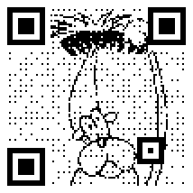

# QR Art
A QR code generator for creating QR codes combined with images or GIF animation. It is based on .NET Core. Code for QR code encoding and GIF encoding is borrowed from [Kazuhiko Arasel's QR code generator implementation](https://github.com/kazuhikoarase/qrcode-generator) in JavaScript and Typescript.

## Usage and Examples
QR Art provides a command line interface:
```
Usage: qr-art [arguments] [options]

Arguments:
  content  Text to encode.
  image    An image to be used as background.
  format   Output image format. [png|gif|svg]
  outpath  Output path.

Options:
  -?|-h|--help             Show help information
  -v|--version             Show version information
  -t|--type <type>         Type number of QR code. [1-39]
  -e|--errcor <level>      Error correct level. [L|M|Q|H]
  -f|--foreground <color>  Foreground color.
  -b|--background <color>  Background color.
  -c|--cell <size>         Cell size.
  -m|--margin <margin>     Margin.
  -a|--animation           Generate animated QR code.
```

```
qr-art "A panda" samples/panda.jpg gif
```
 

```
qr-art "A tree on the grass" samples/tree.jpg gif -f #657981 -b #B8D5F2
```
 

```
qr-art  "A dog combing hair" samples/hair.gif gif -a
```
 
